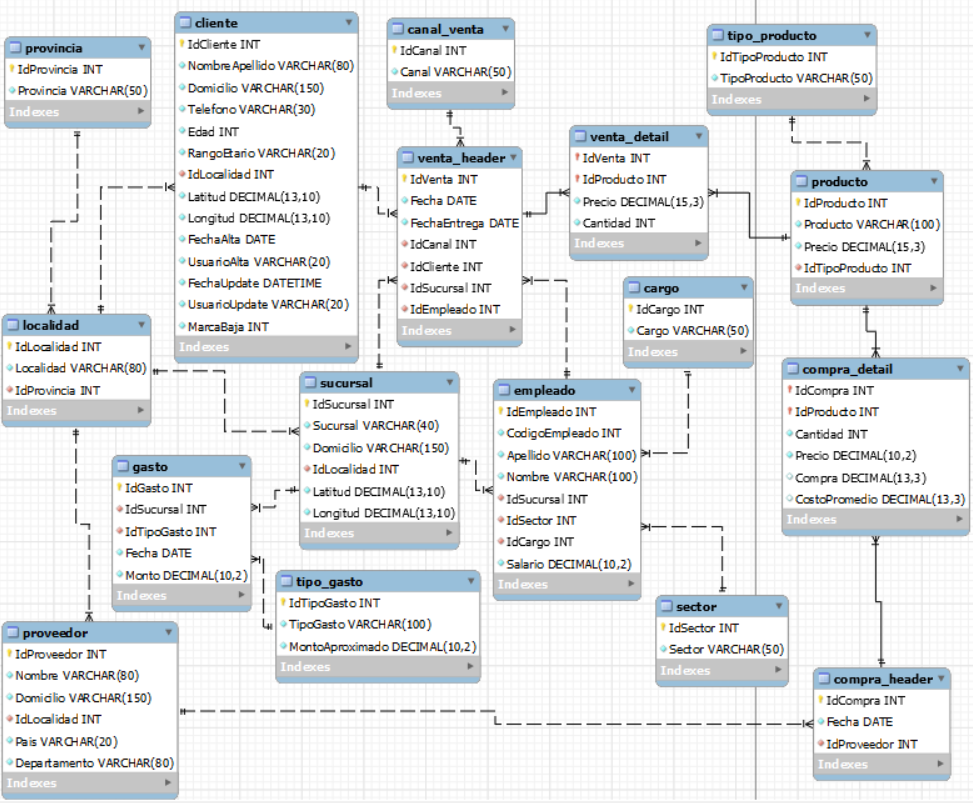
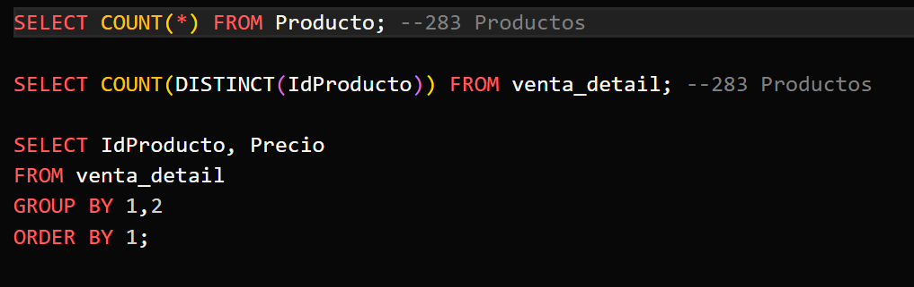
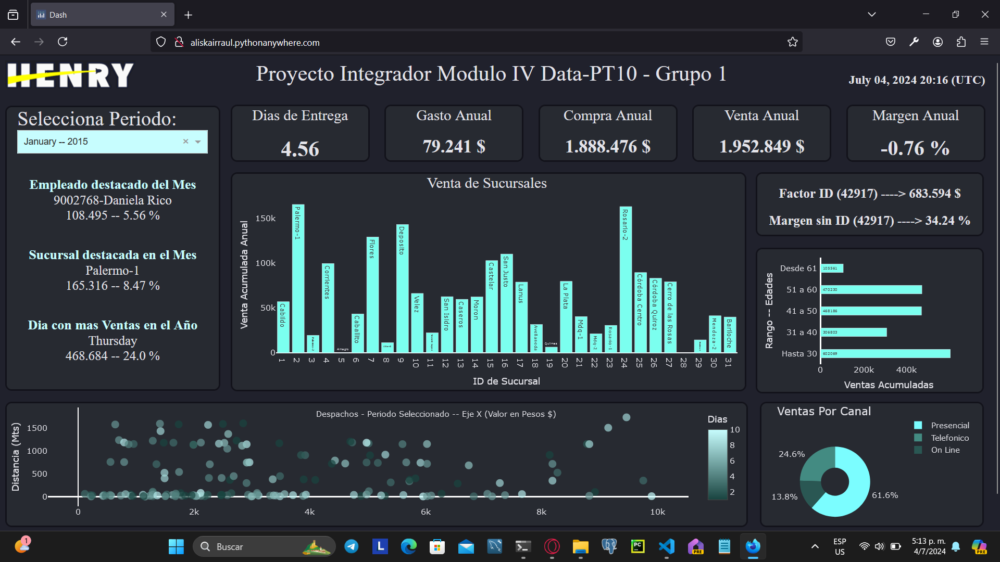
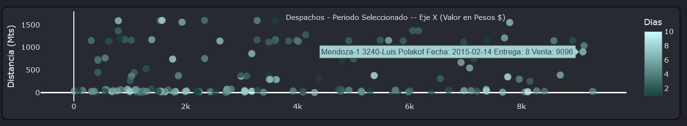

# Proyecto Integrador Modulo IV

Este repositorio está dedicado a compartir el Proyecto Integrador del Modulo IV del Bootcamp Henry en la especialidad de Data Science.  

### Proyecto solicitado

En el M3 se trabajó con con conjunto de datos que simulaban una empresa de venta de productos, deberás tomar ese mismo proceso de ETL y realizarlo con las herramientas Big Data que se verán en este módulo.

### Aspectos a considerar

- Para cumplir con lo solicitado de realizar la Transformación de los datos con Herramientas de Big-Data se creó un Contenedor de Docker con una Imagen de `PYSPARK` que permitió hacer el proceso de Limpieza, Normalización de los Datos, trabajando con Cuadernos Jupyter.
- Los Datos se persistieron en otro Contenedor, pero esta vez de `MySql`.
- Dentro del contenedor de MySql se efctuó el análisis de los datos. Se crearon también procedimientos almacenados que alimentaran nuevas Tablas que resumen la información necesaria a fin de ser mostrada en un Dashboard.
- El Dashboard se realizó con la Libreria `Dash` y se desplegó en la siguiente dirección http://aliskairraul.pythonanywhere.com  

 

# Partes del Proyecto

### ETL con PYSPARK

 Dentro del Repositorio ubicar la carpeta CONTENEDOR-PYSPARK, la cual tiene lo referente al contenedor mod4_pyspark, el cual tiene la siguiente estructura de carpetas:  
 

- /usr/src/app
  - /assets
    - La use para guardar imagenes que llamé desde cuadernos de Jupyter para hacer mas clara alguna acción.
  - /Data
    - Contienen los Archivos csv del inicio del Modulo 3. La Data sin procesar.
  - /db
    - Se encuentra el archivo `connection.py` que contiene la conexion a la base de datos que está en el contenedor que tiene la base de datos MySql, contenedor denominado `mod4_mysql`.
  - /models
    - Se encuentra el arhivo `tables.py` que contiene la estructura de Tablas y relaciones del Datawarehouse. Esto lo realicé apoyandome en el ORM `SqlAlchemy` que permite una interacción robusta entre Python y los distintos motores de Bases de Datos Relacionales.

El Primer paso es ubicarnos en la carpeta `/usr/src/app` y desde terminal (dentro del contenedor `mod4_pyspark`) ejecutar el archivo `create_tables.py` esto creará la siguiente estructura dentro del contenedor `mod4_mysql` 

 

Luego dentro del contenedor `mod4_pyspark` ubicados en la dirección `/usr/src/app` debemos ejecutar uno a uno los siguientes cuadernos Jupyter, en el orden indicado para no violar restricciones de claves Foráneas del modelo creado:

- 01-ETL-tipo_gasto.ipynb
  - Se procesa la data de la tabla `tipo_gasto` del Datawarehouse.
- 02-ETL-canal_venta.ipynb
  - Se procesa la data de la tabla `canal_venta` del Datawarehouse.
- 03-ETL-producto-tipo_producto.ipynb
  - Se procesa la data de las tablas `producto` y `tipo_producto` del Datawarehouse.
- 04-ETL-localidad-provincia.ipynb
  - Se procesa la data de las tablas `provincia`, `localidad`, `sucursal`, `proveedor` y `cliente` del Datawarehouse.
- 05-ETL-compra.ipynb
  - Se procesa la data de las tablas `compra_header` y `compra_detail` del Datawarehouse.
- 06-ETL-gasto.ipynb
  - Se procesa la data de la tabla `gasto` del Datawarehouse.
- 07-ETL-empleado-cargo-sector.ipynb
  - Se procesa la data de las tablas `cargo`, `sector` y `empleado` del Datawarehouse.
- 08-ETL-venta.ipynb
  - Se procesa la data de las tablas `venta_header` y `venta_detail` del Datawarehouse.

### Análisis de los Datos

- Irregularidades en Precios de Ventas
   
  
   

  - Como se observa en la imagen de las 3 consultas, las 2 primeras ratifican que sólo existen 283 Sku comercializados por la cadena de Tiendas.
  - En el Resultado de la `tercera query` se apreció Claramente que TODOS LOS SKUs de la cadena reportan irregularidades de Precio. Específicamente se observan Ventas en TODOS los SKUs donde el Precio es 100 veces el que corresponde, lo cual SUGIERE:
    - Poco probable que los clientes hayan pagado 100 Veces lo que cuesta algo, y al observarse que no son pocos los errores si no que son TODOS los SKUs hace pensar el error haya sido deliverado.
    - Investigar a profundidad y con mucha discrecion si ese dinero Realmente entro en tienda.
    - Para el caso de Estudio se asumirá que el exceso de dinero no entro en tienda, y se corregiran los precios, pero antes se debe hacer una tabla backup de como estaba la original.
    - Tambien se observó que si se excluyen del estudio los casos donde los precios se multiplicaron por 100, no se observa otro cambio en los precios y que los precios coinciden al 100% con los de la tabla `producto`

- Comportamiento de los Precios de Compra

  - Se Observa que aunque TODOS los Skus han sido comprados a Varios Precios, las Variaciones de los mismos son MUY LEVES, lo cual es un comportamiento que bien pudiera atribuirse a:
    - Descuentos por Volumen en algun momento dado. Tomar en cuenta que pudieran haber diversas ESCALAS de compra y por ende diversos DESCUENTOS.
    - Oferta Estacionaria en un momento dado por parte de algún Proveedor, que quiera renovar su stock.
    - Ligero incremento por costo de envio, en algún momento que se haya solicitado mercancia con URGENCIA, para satisfacer un pedido del cual no se tiene stock en el momento, etc etc etc.
    - Para un Análisis de Margen de Comercializacion o Profit en ventas se recomienda obtener un Precio Promedio de Compra por Sku, para asi poder facilitar y mejorar el análisis, esto débido a que en los precios de Venta se observó inflación = 0.
  - Se creó dos Columnas Extras que contendran los valores de `compra` individual de cada transaccion y una de `costo promedio` del sku. Los codigos sql están en el archivo `02_analisis_comportamiento_precios_compras.sql` de la carpeta `scripts_sql` dentro de la Carpeta CONTENEDOR-MYSQL del repositorio.
  - Por último se analizó que peso tiene cada Proveedor dentro de las Compras para ver sí existe una Dependencia excesiva de algún Proveedor que pueda en algún momento representar una amenaza de quedarse sin stock

- Análisis de los Margenes de todos los Skus

  - Se observó un Margen de 30% con una MUY LIGERA variacion para arriba o para abajo, de TODOS los Sku's EXCEPTO 1 El Sku con el codigo `IdProducto 42917` el cual tiene un margen negativo MUY DESFAVORABLE.
    - Aunque (excluyendo al 42917) todos los Skus tienen un margen de aprox 30%, es muy probable, como todo Negocio que existan Productos mas y menos Importantes. Hay que realizar un estudio del Profit Individualizado para ver que productos le aportan mas al negocio.
    - Aunque el Id 42917 tiene un Margen muy desfavorable Todavia es Temprano, en el análisis, para sacar conclusiones. Es necesario ver el profit de este Sku en Particular y evaluar sí lo que ocurre con el, fue algo `puntual`, o por el contrario sea una `situación rutinaria`, donde entonces se debe prender una alarma.
  - Las querys de este análisis estan en el archivo `03_analisis_margenes_skus.sql` de la carpeta `scripts_sql` dentro de la Carpeta CONTENEDOR-MYSQL del repositorio.

- Análisis de Profit de los Sku's

  - Lo del Artículo con el `IdProducto 42917` no es un caso puntual aislado, ya que la magnitud del caso se está llevando el 63% del Profit de la Cadena de Tiendas, se presume comportamiento corrupto pero NO SE SABE si en el departamento de Compras o Ventas. Hay que profundizar en el análisis.
  - Se decide estudiar la relación que existe entre las compras de este Sku y los Proveedores, y se encuentra que este Sku se compra a 13 de los 14 Proveedores que tiene la Cadena, y a precios muy similares. Lo que hace pensar que sea POCO PROBABLE, que TODOS los proveedores se pongan de acuerdo para inflar el precio del mismo Sku.
  - Para el Proyecto SE ASUME que el precio de Compra del SKU 42917 es el correcto y que está siendo comprado a precio de Mercado, ya que es lo mas probable dado que se está comprando a 13 de los 14 Proveedores por igual.
  - Ante la situación de que `un Producto se está comprando a 96000 y se está vendiendo a 11350` y el precio de compra es el Correcto, cabe analizar las ventas individualizadas del SKu a ver sí se encuentra algo.
  - El Articulo en cuestion es una FUNDA PARA NOTEBOOK HP CROSSHATCH 15.6, es Atípico que personas Naturales (No JURIDICAS o NEGOCIOS) compren mas de 1 UNIDAD. El estudio arrojó que hay varias personas con compras muy altas de este SKU lo que pudiera suponer que el acto de corrupción se está dando por una combinación entre el personal administrativo de la empresa y algunos compradores. Toca informar y dar las cuentas a la Gerencia.
  - Las querys de este análisis estan en el archivo `04_profit_skus.sql` de la carpeta `scripts_sql` dentro de la Carpeta CONTENEDOR-MYSQL del repositorio.

- Análisis de la Demora en los Tiempos de Entrega:
  - El estudio arrojó que el tiempo promedio de entrega de la Cadena es de 4.9 dias.
  - El 78.97% de los pedidos están en un rango de distancia (entre el cliente y la respectiva tienda donde realiza la compra), no mayor a 2Km y con un Ticket de Compra que no supera los 10000 Pesos. Lo que hace pensar en la altísima probabilidad de mejorar esa métrica de alguna manera sencilla.
  - Las querys de este análisis estan en el archivo `05_tiempos_entrega.sql` de la carpeta `scripts_sql` dentro de la Carpeta CONTENEDOR-MYSQL del repositorio.

### Presentación a La Gerencia

- En la carpeta `PRESENTACION_A_GERENCIA` se encuentra una pequeña Presentación a la Gerencia, donde se resume el Análisis que se hizo de los datos, donde se informa de la Situación IRREGULAR del `IdProducto 42917`, la situación de los tiempos de entrega tan elevados y se le propone una herramienta de seguimiento a la Gerencia, que le permita monitorear como se están moviendo las ventas, en cuanto a canales de comercialización, rango de edades, ventas por tiendas, tiendas y empleados destacados en ventas, y un monitoreo exhaustivo de la entregas.

### Dashboard Informativo a La Gerencia.

 
 

- Aspectos a tomar en Cuenta:
  - El Dashboard aunque es Informativo está enfocado hacia la Gerencia de La Cadena.
  - El intrumento está pensado para cargar la Data del Año Fiscal en Curso, pero por caso práactico de estudio se le cargan los datos de los 6 años de Información que hay y lógicamente sólo hay data del Pasado.
  - Aunque tiene Data de 6 años los calculos que realiza son del año del periodo Seleccionado. Por ejemplo si se selecciona como periodo `February -- 2017` cuando se refiere a Venta Anual, se refiere a la venta acumulada entre Enero y Febrero del 2017.
  - Se crearon Tablas y Procedimientos Almacenados, que resumen la información que carga el Dashboard cada vez que se llama. Importante aclarar que el Flujo debería ser el siguiente: APP Dash hace petición HTTP a API desarrollada en FastAPI y esta interactua con la Base de Datos para obtener la informacion y devolver la respuesta a la App Dash. De esta forma el Dashboard `sólo solicita información al principio`, y carga toda la información en 4 variables. Esto reduce significativamente el tiempo de respuesta en la interacción con el Dashboard.
  - Por limitaciones a la hora del despliegue del Dashboard, sólo encontré una pagina que me permitía hacer el despliegue de forma gratuita `paythonanywhere.com` que pertenece a `anaconda`, pero aca sólo pude desplegar de manera gratuita el Dashboard. Por lo que quedo por fuera para el ejemplo la API y la Base de Datos, y busque como solución descargar las 4 tablas resumenes de 6 años en 4 archivos `csv` que el Dashboard lee al principio y sigue su ejecusión.
  - Se debe Instruir a La Gerencia para saber interpretar la información acerca de los despachos que emite el Dashboard.
    - Cada burbuja representa un despacho del periodo seleccionado, dentro del limite de 2 Kilometros de distancia y el Costo de 10000 pesos.
    - Mientras mas claro sea la burbuja mas retrazado estuvo ese despacho.
    - Al hacer `hover` (pasar el puntero del mouse sobre una burbuja), se desplega la información de Sucursal, Codigo y Nombre de Cliente, Fecha del pedido, Dias que tardó en entregarse y monto del despacho. Lo cual sirve para monitorear. 
      
       
  - http://aliskairraul.pythonanywhere.com

### Autor:

Aliskair Rodríguez 
Henry Bootcamp Data Science 
Cohorte Data-PT10
